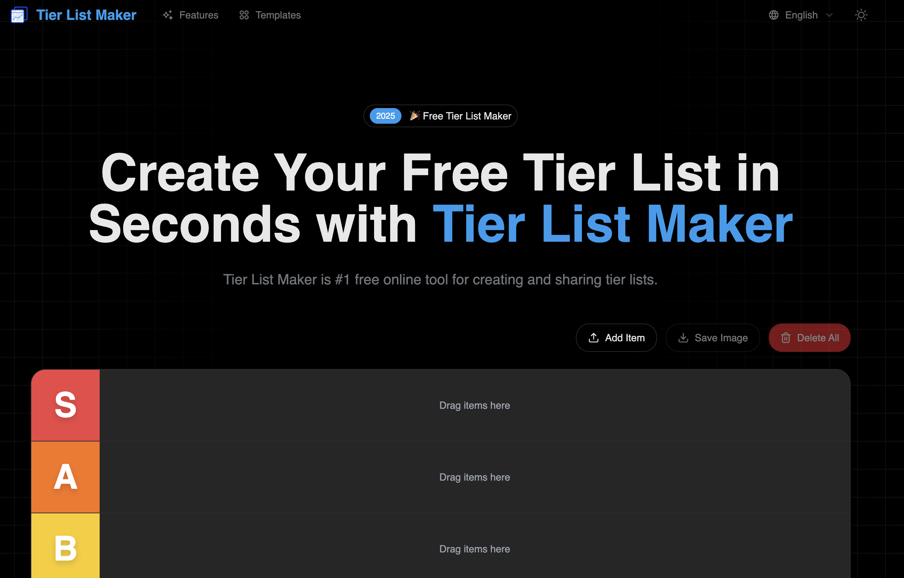

# Tier表制作工具

🎯 **免费在线Tier表制作工具** - 几秒钟内创建和分享专业的排名表！



## ✨ 功能特性

- 🆓 **永久100%免费** - 无需注册，没有隐藏费用
- 🎨 **拖放式界面** - 直观易用
- 📱 **移动端友好** - 在所有设备上无缝运行
- 💾 **自动保存** - 使用localStorage永不丢失工作
- 🖼️ **高质量导出** - 下载为PNG图片
- 🌐 **多语言支持** - 支持英文和中文
- 🎯 **5级分层系统** - S、A、B、C、D排名系统

## 🚀 快速开始

### 前置要求

- Node.js 18+ 
- pnpm（推荐）或 npm

### 安装步骤

1. 克隆仓库

```bash
git clone https://github.com/zhangchenchen/tier_list_maker.git
cd tier_list_maker
```

2. 安装依赖

```bash
pnpm install
```

3. 设置环境变量

```bash
cp .env.example .env.development
```

4. 运行开发服务器

```bash
pnpm dev
```

打开 [http://localhost:3000](http://localhost:3000) 查看应用。

## 🎨 自定义配置

### 主题

在 `src/app/theme.css` 中设置主题颜色

你可以使用 [TweakCN主题编辑器](https://tweakcn.com/editor/theme) 来自定义颜色。

### 落地页内容

编辑以下文件中的内容：
- 英文：`src/i18n/pages/landing/en.json`
- 中文：`src/i18n/pages/landing/zh.json`

### 消息和翻译

更新翻译文件：
- `src/i18n/messages/en.json`
- `src/i18n/messages/zh.json`

## 📦 构建

构建生产版本：

```bash
pnpm build
```

本地测试生产构建：

```bash
pnpm start
```

## 🚢 部署

### 部署到 Vercel（推荐）

[](https://vercel.com/new)

1. 将代码推送到 GitHub
2. 在 Vercel 中导入你的仓库
3. 部署！

### 部署到 Cloudflare Pages

1. 构建项目：

```bash
pnpm build
```

2. 使用 `.next` 输出部署到 Cloudflare Pages

## 🛠️ 技术栈

- **框架**：[Next.js 15](https://nextjs.org/)
- **语言**：[TypeScript](https://www.typescriptlang.org/)
- **样式**：[Tailwind CSS](https://tailwindcss.com/)
- **UI组件**：[Shadcn UI](https://ui.shadcn.com/)
- **国际化**：[next-intl](https://next-intl-docs.vercel.app/)
- **图片导出**：[html2canvas](https://html2canvas.hertzen.com/)
- **通知**：[Sonner](https://sonner.emilkowal.ski/)

## 📁 项目结构

```
tier_list_maker/
├── src/
│   ├── app/              # Next.js App Router
│   ├── components/       # React 组件
│   │   ├── blocks/       # 落地页区块
│   │   │   └── hero/     # Hero区域与Tier表制作工具
│   │   └── ui/           # Shadcn UI 组件
│   ├── i18n/             # 国际化
│   │   ├── messages/     # 全局翻译
│   │   └── pages/        # 页面特定翻译
│   ├── lib/              # 工具函数
│   └── types/            # TypeScript 类型
├── public/               # 静态资源
└── content/             # MDX 文档
```

## 🎯 核心组件

### Tier表制作工具

位置：`src/components/blocks/hero/tier-list-maker.tsx`

功能特性：
- 拖放式项目组织
- localStorage自动保存
- 移动端快捷菜单
- 实时主题检测
- 高质量PNG导出
- 加载状态和进度反馈

## 🌐 国际化

项目支持多语言：

- 英语（`en`）
- 中文（`zh`）

添加更多语言：
1. 在 `src/i18n/messages/` 中创建新的JSON文件
2. 在 `src/i18n/pages/landing/` 中添加翻译
3. 更新 `src/i18n/routing.ts` 中的语言配置

## 📝 开源协议

[MIT License](LICENSE)

## 🤝 贡献

欢迎贡献！请随时提交 Pull Request。

## 📧 联系方式

- 网站：[tierlist-maker.com](https://tierlist-maker.com)
- 邮箱：support@tierlist-maker.com

---

由 Tier表制作工具团队用 ❤️ 制作

